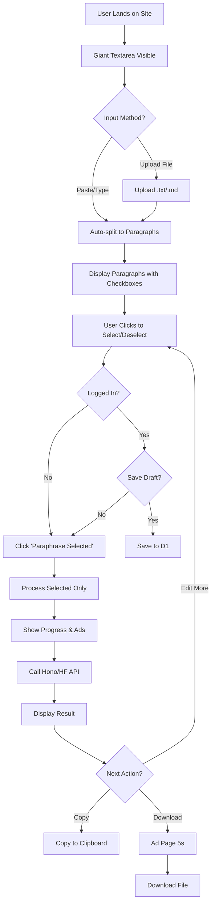

# 6. Information Architecture 🕸️

## 🗺️ Site Map

```
Home (/)
├── Header
│   ├── Logo
│   ├── Menu (Home, Blog, About)
│   └── CTA (Support Us)
├── Hero Section
│   ├── Headline (H1)
│   ├── Sub-headline
│   └── Tool Interface (The App)
│       ├── Tabs (Text | Document)
│       ├── Input Area / Dropzone
│       ├── Action Button (Paraphrase)
│       └── Output Area / Download
├── Features Section
│   ├── Why Us
│   └── How it Works
├── Ad Space (Middle)
├── FAQ Section (SEO Content)
└── Footer
    ├── Links (Privacy Policy, Terms, Contact)
    ├── Copyright
    └── Social Icons
```

## 🔄 User Flow Diagram (Updated with Selective Paraphrase)



## 📂 Directory Structure (Monorepo)

```
indo-paraphrase/
├── apps/
│   ├── web/                 # React + Vite (Frontend)
│   │   ├── src/
│   │   │   ├── components/  # UI Components
│   │   │   ├── hooks/       # Custom Hooks
│   │   │   └── pages/       # Route Pages
│   │   └── public/
│   └── api/                 # Hono (Backend Worker)
│       ├── src/
│       │   └── index.ts     # API Routes
│       └── wrangler.toml    # Cloudflare Config
├── packages/
│   └── ui/                  # Shared UI (Optional)
├── docs/                    # Documentation (This folder)
├── package.json             # Root Config
└── turbo.json              # Turborepo Config (Optional)
```
