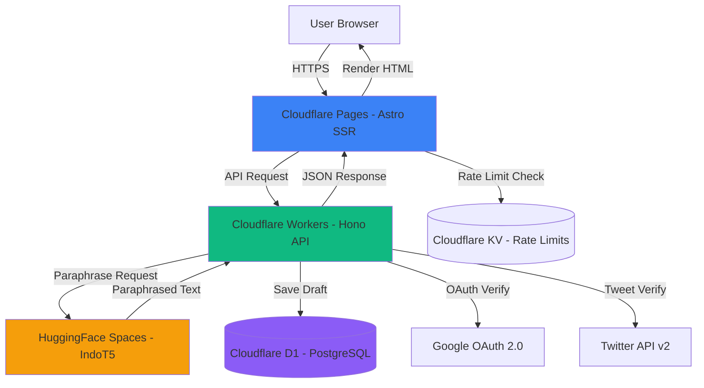
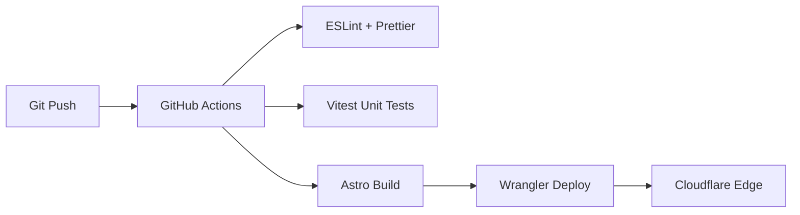

# 7. Technical Architecture 🏗️

## 🎯 System Overview

IndoParaphrase adalah full-stack serverless application yang di-deploy di **Cloudflare Edge Network** untuk performa maksimal dan zero server management cost.

## 📐 Architecture Diagram



## 🛠️ Tech Stack Details

### Frontend (Cloudflare Pages)
**Framework**: Astro v5+ with React Islands

**Why Astro?**
- ✅ **SSR/SSG Hybrid**: SEO-perfect HTML pre-rendered di server
- ✅ **Zero JS by Default**: Hanya load JS untuk interactive components (ParaphraseEditor)
- ✅ **Fast Build**: ~3-5s build time untuk deploy
- ✅ **Edge Rendering**: Astro running di Cloudflare Edge = <50ms TTFB globally

**Styling**: TailwindCSS v4 (Vite plugin)
**Interactive Components** (React Islands):
1. `ParaphraseEditor.tsx` - Main editor with 3-stage flow
2. `AuthButton.tsx` - Google OAuth login/logout
3. `RateLimitBanner.tsx` - Show remaining quota
4. `ShareButtons.tsx` - Twitter share dengan auto-generated tweet

### Backend (Cloudflare Workers)
**Framework**: Hono.js v4+

**Why Hono?**
- ✅ **Ultralight**: 12KB gzipped (vs Express 200KB)
- ✅ **TypeScript Native**: Type-safe API routes
- ✅ **Cloudflare Optimized**: Built specifically for Workers runtime
- ✅ **Fast Routing**: Linear time complexity O(n)

**API Routes**:
```
POST   /api/paraphrase       # Main paraphrase endpoint
GET    /api/rate-limit       # Check user quota
POST   /api/auth/google      # Google OAuth callback
POST   /api/drafts           # Save draft
GET    /api/drafts/:userId   # Load drafts
DELETE /api/drafts/:id       # Delete draft
POST   /api/share/verify     # Verify Twitter share
GET    /api/referral/:code   # Track referral
```

**Middleware Stack**:
1. CORS (allow frontend origin)
2. Rate Limiter (IP + fingerprint) 
3. Auth Guard (verify JWT for protected routes)
4. Request Logger (D1 analytics)

### Database (Cloudflare D1)
**Type**: SQLite-compatible (serverless SQL)

**Schema**:
```sql
-- Users (from Google OAuth)
CREATE TABLE users (
  id TEXT PRIMARY KEY,
  email TEXT UNIQUE NOT NULL,
  name TEXT,
  picture TEXT,
  created_at INTEGER NOT NULL
);

-- Saved drafts
CREATE TABLE drafts (
  id INTEGER PRIMARY KEY AUTOINCREMENT,
  user_id TEXT NOT NULL REFERENCES users(id),
  content TEXT NOT NULL,
  selected_paragraphs TEXT, -- JSON array of indexes
  created_at INTEGER NOT NULL,
  FOREIGN KEY (user_id) REFERENCES users(id) ON DELETE CASCADE
);
CREATE INDEX idx_drafts_user ON drafts(user_id);

-- Rate limiting (per user/IP)
CREATE TABLE rate_limits (
  id TEXT PRIMARY KEY, -- user_id or IP hash
  hourly_count INTEGER DEFAULT 0,
  daily_count INTEGER DEFAULT 0,
  last_reset_hour INTEGER,
  last_reset_day INTEGER
);

-- Referrals
CREATE TABLE referrals (
  code TEXT PRIMARY KEY,
  user_id TEXT NOT NULL REFERENCES users(id),
  signups INTEGER DEFAULT 0,
  bonus_docs INTEGER DEFAULT 0
);

-- Twitter shares (verified)
CREATE TABLE twitter_shares (
  tweet_id TEXT PRIMARY KEY,
  user_id TEXT NOT NULL REFERENCES users(id),
  verified_at INTEGER NOT NULL,
  reward_given BOOLEAN DEFAULT FALSE
);
```

**Query Optimization**:
- Indexed on `user_id`, `created_at` untuk fast lookups
- Batch inserts untuk analytics (non-blocking)
- Read replicas (D1 auto-handles)

### AI Engine (HuggingFace Spaces)
**Model**: `Wikidepia/IndoT5-base-paraphrase`
**Runtime**: Gradio API (free tier, CPU)

**API Integration**:
```typescript
// Simplified call
const response = await fetch('https://0xbujang-indonesia-paraphrase.hf.space/api/predict', {
  method: 'POST',
  headers: { 'Content-Type': 'application/json' },
  body: JSON.stringify({ data: [paragraph] })
});
const { data } = await response.json();
const paraphrased = data[0];
```

**Fallback Strategy** (if HF down):
1. Retry 3x with exponential backoff
2. If still fails → return original text dengan warning banner
3. Log incident untuk manual check

### Rate Limiting (Cloudflare KV)
**Storage**: KV for fast edge reads

**Structure**:
```typescript
// Key: `ratelimit:${userId || ipHash}:${hour|day}`
// Value: { count: number, resetAt: timestamp }
```

**Algorithm**:
- Sliding window counter (per hour/day)
- Reset at top of hour/day (UTC)
- Atomic increment with KV

## 🔐 Security Architecture

### Authentication
- **Google OAuth 2.0** (most trusted by Indonesian users)
- JWT stored in `httpOnly` cookie (XSS protection)
- CSRF token for state changes
- Refresh token rotation

### Rate Limiting Defense
- **Layer 1**: IP-based (Cloudflare magic)
- **Layer 2**: Browser fingerprint (FingerprintJS)
- **Layer 3**: User ID (authenticated users)
- **Ban List**: Cloudflare KV for blocked IPs (24h TTL)

### Data Privacy
- **No PII storage** (except email for auth)
- Dokumen content **not stored** (processed on-the-fly)
- Draft content **encrypted at rest** (D1 encryption)
- GDPR-compliant (right to delete account)

## 🌍 Infrastructure & Deployment

### Hosting
**Frontend**: Cloudflare Pages
- Auto-deploy dari Git
- Global CDN (200+ cities)
- Edge rendering di region terdekat user

**Backend**: Cloudflare Workers
- Deployed ke semua edge locations
- 0ms cold start (keep-warm via cron)

**Database**: Cloudflare D1
- Regional replica (Southeast Asia primary)
- Auto-backup daily

### CI/CD Pipeline


**Steps**:
1. Push to `main` → trigger GitHub Actions
2. Run linters + tests
3. Build Astro (`npm run build`)
4. Deploy to Cloudflare via Wrangler
5. Smoke test (health check endpoint)

### Monitoring & Observability

**Metrics** (via Cloudflare Analytics):
- Request count per endpoint
- P50/P95/P99 latency
- Error rate (4xx/5xx)
- Bot traffic detection

**Logs** (via Logflare/Loki):
- API errors (structured JSON)
- User actions (anonymized)
- Rate limit violations

**Alerts** (via PagerDuty/Discord webhook):
- Error rate >5% for 5 min → alert
- HuggingFace Space down → alert
- D1 write errors → alert

## 💰 Cost Estimation (Monthly)

| Service | Free Tier | Estimated Usage | Cost |
|---------|-----------|-----------------|------|
| **Cloudflare Pages** | Unlimited | 100k builds/month | **$0** |
| **Cloudflare Workers** | 100k req/day | ~50k req/day | **$0** |
| **Cloudflare D1** | 5GB + 5M reads | ~100k rows | **$0** |
| **Cloudflare KV** | 100k reads/day | ~30k reads/day | **$0** |
| **HuggingFace Space** | Free CPU tier | Free tier | **$0** |
| **Domain** | - | 1 domain | **~$12/year** |
| **Google OAuth** | Free | Unlimited | **$0** |

**Total Monthly**: **~$1** (domain only)

**At Scale** (10k users/day):
- Workers: $5/10M req → **~$15/month**
- D1: $5/month beyond free tier → **~$10/month**
- HF Space upgrade to GPU → **~$432/month** ($0.60/hr * 24 * 30)

**Revenue Required to Break Even**: **~$457/month** at scale
**Ad Revenue (conservative)**: $5 RPM * 10k users * 2 pages/session = **~$100/day** = **$3000/month**

**Profitability**: Positive even at 10k DAU! 🎉

## 📈 Scalability Plan

**Phase 1** (0-1k DAU): Current architecture (100% free tier)
**Phase 2** (1k-10k DAU): Upgrade HF to GPU ($432/month), still profitable
**Phase 3** (10k-100k DAU): Self-host model on Cloudflare AI Workers (~$200/month)
**Phase 4** (100k+ DAU): Dedicated GPU cluster (Runpod/Modal) + CDN cache

## 🔧 Developer Experience

**Local Development**:
```bash
# Frontend
cd apps/web
npm run dev  # Astro dev server :4321

# Backend
cd apps/api  
npm run dev  # Wrangler dev :8787
```

**Tech Debt Prevention**:
- TypeScript strict mode
- ESLint + Prettier (auto-fix on commit)
- Husky pre-commit hooks
- Dependabot for deps update
